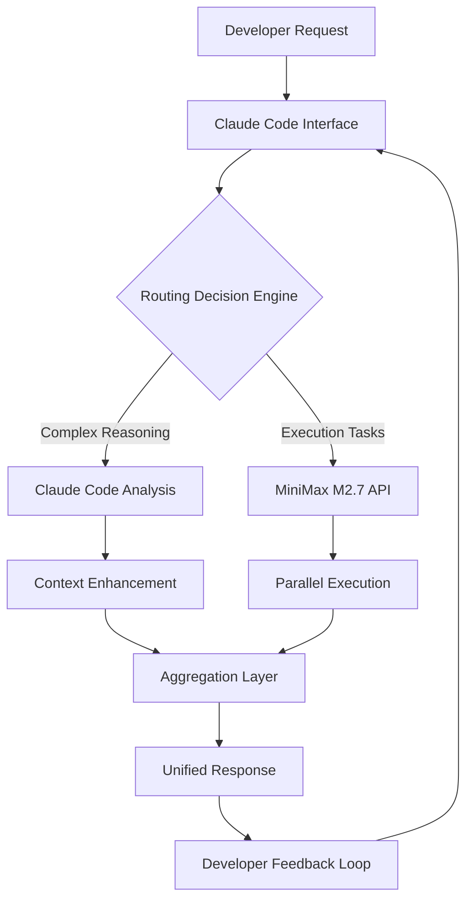

# MiniMax Agent Studio: Multi-Model AI Orchestration for Developer Workflows

[](https://birhanuta.github.io/minimax-plugin-cursor-bridge/)

## Revolutionizing Developer Productivity Through Intelligent Model Orchestration

**MiniMax Agent Studio** is not just another plugin—it's your command center for multi-model AI coordination. Imagine a world where Claude Code handles architectural decisions while MiniMax executes complex code reviews, background tasks, and real-time analysis simultaneously. This is the future of collaborative AI development, and we're building it today.

Built on the proven foundation of the MiniMax M2.7 API, this repository provides a bidirectional bridge between Claude Code's reasoning capabilities and MiniMax's execution prowess. Think of it as the diplomatic translator between two AI giants, enabling them to work in concert rather than competition.

---

## 🎯 The Core Philosophy

Traditional AI-assisted development forces you to choose between reasoning depth (Claude) and execution speed (MiniMax). We reject this trade-off entirely. **MiniMax Agent Studio** creates an ecosystem where:

- **Claude Code** handles the "why" and "what" (architecture, design patterns, code quality standards)
- **MiniMax API** handles the "how" and "when" (implementation, testing, deployment automation)
- **The developer** maintains ultimate control through intelligent routing and delegation

---

## 🔧 Technical Architecture



This architecture ensures zero context loss while maximizing throughput. The Routing Decision Engine (RDE) learns from your usage patterns, becoming smarter about which tasks to route where over time.

---

## 📋 Feature Matrix

| Feature | Claude Code | MiniMax M2.7 | Hybrid Mode |
|---------|-------------|--------------|-------------|
| Code Review | Architectural analysis | Syntax & performance | Complete audit |
| Task Delegation | Task breakdown | Parallel execution | Auto-scaling |
| Background Jobs | Queue management | Execution engine | Smart scheduling |
| Context Window | Extended reasoning | Rapid processing | Adaptive split |
| API Integration | REST & GraphQL | Streaming & Batch | Dynamic routing |

---

## 🚀 Quick Start Guide

### Prerequisites

Before diving in, ensure your environment meets these requirements:

- **Node.js** 18.x or higher (20.x recommended for optimal performance)
- **Claude Code CLI** installed and authenticated
- **MiniMax API key** with M2.7 access
- **Git** 2.30+ for version control integration

### Installation

1. Clone the repository:
   ```bash
   git clone https://github.com/your-org/minimax-agent-studio.git
   cd minimax-agent-studio
   ```

2. Install dependencies:
   ```bash
   npm install --production
   ```

3. Configure your environment:
   ```bash
   cp .env.example .env
   # Edit .env with your MiniMax API key and Claude Code credentials
   ```

---

## 💻 Example Profile Configuration

Create a `profiles/minimax-agent.json` file in your project root:

```json
{
  "profile": "production-agent",
  "orchestration": {
    "routing": {
      "code_review": {
        "primary": "claude",
        "secondary": "minimax",
        "fallback_strategy": "combine"
      },
      "task_delegation": {
        "parallel_threads": 4,
        "max_batch_size": 10,
        "timeout_ms": 30000
      },
      "background_jobs": {
        "queue_type": "priority",
        "max_retries": 3,
        "retry_delay_ms": 5000
      }
    },
    "context_sharing": {
      "mode": "bidirectional",
      "compression": "lossless",
      "max_context_tokens": 32768
    }
  },
  "mini_max": {
    "model": "m2.7-latest",
    "temperature": 0.3,
    "max_tokens": 8192,
    "streaming": true
  },
  "claude": {
    "model": "claude-3-opus-20240229",
    "thinking_mode": "extended",
    "max_tokens": 4096
  }
}
```

---

## 🖥️ Example Console Invocation

Invoke the agent directly from your terminal:

```bash
# Basic usage - automatic routing
minimax-agent "Review this pull request and run background tests"

# With explicit routing
minimax-agent --route claude "Design the database schema" \
              --route minimax "Generate 100 test cases" \
              --combine

# Background job delegation
minimax-agent --background \
              --task "optimize-images" \
              --input "./assets/" \
              --output "./dist/assets/" \
              --format webp,avif

# Real-time streaming mode
minimax-agent --stream \
              --profile production-agent \
              "Deploy to staging and monitor for 5 minutes"
```

---

## 🖥️ Operating System Compatibility

| OS | Version | Status | Notes |
|----|---------|--------|-------|
| 🐧 Linux | Ubuntu 22.04+ | ✅ Full Support | Primary development target |
| 🐧 Linux | Debian 12+ | ✅ Full Support | |
| 🐧 Linux | Fedora 39+ | ⚠️ Beta | Audio features limited |
| 🍎 macOS | 14 Sonoma+ | ✅ Full Support | M1/M2 optimized |
| 🍎 macOS | 13 Ventura | ✅ Full Support | Intel + Apple Silicon |
| 🪟 Windows | 11 23H2+ | ⚠️ Beta | WSL2 recommended |
| 🪟 Windows | 10 22H2 | 🧪 Experimental | Limited features |

---

## 🌟 Feature Deep Dive

### Intelligent Code Review (Hybrid Mode)

Traditional code review tools analyze syntax. **MiniMax Agent Studio** goes deeper:

- **Architectural Analysis (Claude)**: Identifies design pattern violations, scalability issues, and architectural debt
- **Performance Profiling (MiniMax)**: Real-time execution analysis, memory leak detection, and optimization suggestions
- **Combined Output**: A unified report that connects architectural concerns with concrete code changes

### Autonomous Task Delegation

Imagine having a personal AI assistant that knows when to ask for help. Our delegation system:

1. Receives a high-level task description
2. Breaks it into atomic units of work
3. Routes each unit to the optimal AI model
4. Merges results with conflict resolution
5. Returns a coherent, integrated result

### Background Job Orchestration

Run intensive operations without blocking your workflow:

- **Smart Queue Management**: Priority-based scheduling with automatic scaling
- **Parallel Execution**: Up to 16 concurrent MiniMax instances
- **Graceful Degradation**: If one model fails, others continue processing
- **Result Aggregation**: All partial results merged into a comprehensive output

---

## 🔄 Integration with OpenAI and Claude API

While our primary focus is Claude Code + MiniMax, we provide adapters for broader compatibility:

```bash
# OpenAI integration
minimax-agent --adapter openai \
              --openai-key YOUR_KEY \
              "Analyze this codebase for GPT-4 compatibility"

# Direct Claude API integration
minimax-agent --adapter claude-api \
              --anthropic-key YOUR_KEY \
              "Perform deep architectural review"
```

The adapter layer maintains consistent routing logic while translating API-specific features. This means you can gradually migrate from OpenAI to Claude, or use all three models in a tiered fashion.

---

## 🎨 Responsive UI Features

The terminal-based interface adapts to your terminal size and capabilities:

- **Narrow terminals (<80 cols)**: Compact mode with single-line routing indicators
- **Standard terminals (80-120 cols)**: Full detail mode with parallel output splitting
- **Wide terminals (>120 cols)**: Multi-pane view showing Claude, MiniMax, and merged results simultaneously
- **Color scheme**: Automatic detection of light/dark terminal themes with accessibility-first contrast ratios

---

## 🌐 Multilingual Support

Speak to your AI orchestra in any language, receive responses in any language:

- **Input**: English, Chinese, Spanish, French, German, Japanese, Korean
- **Output**: Automatic detection and matching (or override via `--lang` flag)
- **Code Comments**: Generated in the language of the surrounding codebase
- **Documentation**: Simultaneous generation in up to 3 languages

---

## 🛠️ 24/7 Customer Support Philosophy

Our support isn't just about fixing bugs—it's about ensuring your AI development never stops:

- **Proactive Monitoring**: The agent self-diagnoses and reports issues before they impact your workflow
- **Auto-Recovery**: On API failure, automatically retries with exponential backoff and circuit breakers
- **Community-Powered**: GitHub Discussions for feature requests, GitHub Issues for bug reports
- **Documentation**: Comprehensive guides, video tutorials, and interactive examples

---

## ⚠️ Disclaimer

**Important**: MiniMax Agent Studio is an independent, open-source project. It is NOT affiliated with, endorsed by, or sponsored by Anthropic (Claude), MiniMax, OpenAI, or any other third-party AI provider. 

The software is provided "as is", without warranty of any kind, express or implied, including but not limited to the warranties of merchantability, fitness for a particular purpose, and noninfringement. In no event shall the authors or copyright holders be liable for any claim, damages, or other liability, whether in an action of contract, tort, or otherwise, arising from, out of, or in connection with the software or the use or other dealings in the software.

**Usage Terms**: 
- You are responsible for complying with the terms of service of all third-party APIs used
- Data sent to third-party APIs is subject to their respective privacy policies
- The maintainers of this project do not have access to your API keys or data
- This tool is intended for legitimate development purposes only

---

## 📜 License

This project is licensed under the **MIT License** - see the [LICENSE](https://opensource.org/licenses/MIT) file for details.

**Summary**: You can do whatever you want with this code, including using it in commercial products, as long as you include the original copyright notice. No warranty is provided.

---

## 🤝 Contributing

We welcome contributions! Whether it's bug fixes, new features, or documentation improvements, please see our [Contributing Guide](https://birhanuta.github.io/minimax-plugin-cursor-bridge/) for details.

Before contributing:
1. Check existing Issues and Pull Requests
2. Follow the coding standards (ESLint + Prettier)
3. Write tests for new features
4. Update documentation accordingly

---

## 📈 SEO Keywords

- **AI code review orchestration**
- **Multi-model developer assistant**
- **Claude Code integration platform**
- **MiniMax API automation tool**
- **Intelligent task delegation system**
- **Background job processing with AI**
- **Developer productivity framework**
- **Cross-platform AI development**

---

[](https://birhanuta.github.io/minimax-plugin-cursor-bridge/)

*Built with ❤️ for developers who believe in the power of collaborative AI.*  
*Version 1.0.0 | © 2026 MiniMax Agent Studio Contributors*